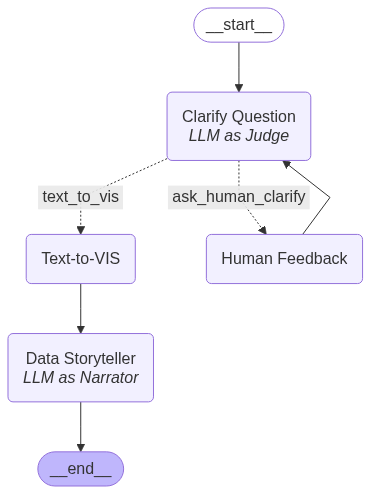

# Text-to-VIS and Data Storytelling with LLMs

This repository accompanies a short paper developed for the course **INF2063 – Planning and Storytelling for AI in Startups**, 2025.1, Department of Informatics, PUC-Rio.

## Overview

This work presents a workflow that integrates **Text-to-VIS** (e.g., Vanna AI) and **data storytelling** using Large Language Models (LLMs).  
Given a natural language query and a dataset, the system performs the following steps:

1. **Text-to-Code Generation**: The LLM translates the question into Python code for data visualization.
2. **Visualization**: The code is executed to generate a chart using libraries like `plotly`.
3. **Narrative Generation**: A natural language explanation is generated to describe trends, patterns, and insights from the visualization.

The goal is to explore how LLMs can assist in transforming raw data into meaningful visual stories, making insights accessible to broader audiences.

---

## Case Studies

Three case studies were designed to evaluate different data storytelling challenges using LLMs:

### 1. Number of Movies Released by Year  
Analyzes how LLMs handle time-based queries and temporal trends in data.

### 2. Which Movie Genres Have the Highest Average Gross Income?  
Evaluates how LLMs process categorical data and summarize aggregated values in visual form.

### 3. Is There a Relationship Between Movie Budget and Gross Income?  
Focuses on LLMs’ ability to explore relationships and correlations between continuous variables.

---
